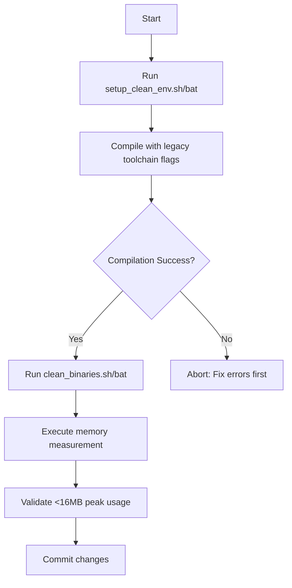

# RetroZig Compiler - AI Agent Guidelines

## Overview

This document outlines the roles, responsibilities, development methodology, constraints, and communication protocols for AI agents working on the RetroZig compiler project. It serves as a guide for both human developers initiating requests and the AI agents executing them.

## Project Context

- **Goal**: Develop a C++98 compatible compiler capable of running on circa 1998 hardware/software environments.
- **Constraints**:
    - **Language Standard**: C++98.
    - **Memory Limit**: Significantly less than 16MB peak usage.
    - **Dependencies**: Win32 API (kernel32.dll) only. No third-party libraries.
    - **Compiler Compatibility**: Must work with older toolchains (e.g., MSVC 6.0 quirks like `__int64`).

## Current Status: Milestone 4 (Task 166)

We are implementing the bootstrap type system and semantic analysis with strict C89 compatibility constraints.

### Key Architectural Components

1. **Multi-Phase Compilation Pipeline** (`CompilationUnit::performFullPipeline`)
2. **Feature Detection & Rejection** (`C89FeatureValidator`)
3. **Comprehensive Cataloguing** (9 specialized catalogues)
4. **Pass-Based Semantic Analysis** (Type checking → Validation → Lifetime → Null pointer → Double free)

## AI Agent Role: Specialized Compiler Implementer

The AI agent acts as a focused, knowledgeable assistant for implementing specific, well-defined tasks within the compiler project.

### Responsibilities of the AI Agent

1. **Interpret Tasks**: Accurately parse and understand the task description provided in `AI_tasks.md`.
2. **Consult Documentation**: Read and comprehend relevant project documents (`Design.md`, `lexer.md`, `AST_parser.md`, etc.) before implementing.
3. **Adhere to Constraints**: Strictly follow all technical constraints (C++98, memory limits, dependencies) without deviation.
    - **C++ Standard Library Usage Policy**:
        - **Allowed**: Headers that are generally implemented by the compiler and have no external runtime library dependencies or hidden memory allocations. This includes headers like `<new>` (for placement new), `<cstddef>` (for size_t), `<cassert>` (for assert), and `<climits>`.
        - **Forbidden**: Headers that depend on a C/C++ runtime library (like msvcrt.dll beyond kernel32.dll) or perform dynamic memory allocation. This includes headers like `<cstdio>` (fprintf), `<cstdlib>` (malloc), `<iostream>`, `<string>` (std::string), and `<vector>` (std::vector).
        - **Exceptions**:
            - `<cstdlib>`: Allowed *only* for `abort()` (for fatal error handling in the parser), and `strtol`/`strtod` (for number parsing in the lexer). Direct memory management functions like `malloc` and `free` are strictly forbidden; use `plat_alloc` and `plat_free` instead.
    - **Platform Abstraction Layer (PAL)**:
        - All system-level operations (memory, files, console) MUST use the PAL (`platform.hpp`) to ensure compatibility and ease of development across Windows and Linux.
4. **Implement Code**: Generate C++ code (.h, .cpp files) that fulfills the task requirements, considering architecture principles like Arena Allocation and string interning.
5. **Document Changes**: Update existing documentation (e.g., `AST_parser.md`) and add Doxygen-style comments to the generated code.
6. **Task Review**: Review completed tasks for architectural alignment and completeness.
7. **Seek Clarification**: When encountering ambiguity in task specifications or required decisions not covered by documentation, explicitly ask for clarification rather than making assumptions.
8. **Follow Methodology**: Implement code with a Test-Driven Development (TDD) mindset, ensuring modularity and correctness for future testing phases.

## Memory Management Protocol (Task 166+)

### Persistent Instrumentation
The codebase now contains persistent memory instrumentation guarded by `#ifdef MEASURE_MEMORY`. This instrumentation MUST remain in the codebase to facilitate ongoing memory analysis and regression testing.

### Phase-Aware Analysis Required
All memory-related work must track usage across compilation phases:
1. **Lexing & Parsing**: AST node creation, string interning
2. **Type Checking**: Type objects, symbol table expansion
3. **C89 Validation**: Catalogue population
4. **Semantic Analysis**: Analysis state tracking
5. **Code Generation**: Output buffers

### Catalogue Memory Overhead
The compiler maintains 9 catalogues for feature tracking. Memory impact:
- `ErrorSetCatalogue`: Error set definitions and merges
- `GenericCatalogue`: Generic function instantiations
- `ErrorFunctionCatalogue`: Error-returning functions
- Try/Catch/Orelse catalogues: Error handling patterns
- `ExtractionAnalysisCatalogue`: C89 translation strategies
- `ErrDeferCatalogue`: Errdefer statements
- `IndirectCallCatalogue`: Function pointer calls

**Guideline**: When implementing catalogue features, estimate memory per entry (≈ 32-64 bytes).

### Optimization Priority List
When memory exceeds thresholds, optimize in this order:
1. **Catalogue entries** (largest potential savings)
2. **AST node allocations** (biggest baseline consumer)
3. **Type object sharing** (reduce duplication)
4. **String interning** (hash table optimization)
5. **Phase memory reuse** (arena reset between phases)
   
## Environment Setup & Build Maintenance

### Clean Environment Setup Script

Before development or testing, initialize a pristine build environment using the appropriate script for your platform. These scripts enforce project constraints by verifying toolchain compatibility and isolating build artifacts.

#### Linux/macOS (`scripts/setup_clean_env.sh`)
```bash
#!/bin/bash
set -euo pipefail

PROJECT_ROOT="$(cd "$(dirname "${BASH_SOURCE[0]}")/.." && pwd)"
BUILD_DIR="$PROJECT_ROOT/build"
BIN_DIR="$PROJECT_ROOT/bin"

echo "=== RetroZig Clean Environment Setup ==="

# Verify C++98-compatible compiler
if ! g++ --version 2>/dev/null | grep -q "g.. (GCC) [234]\."; then
    echo "WARNING: Non-C++98 compiler detected. Ensure -std=c++98 flag is used."
fi

# Create isolated directories
rm -rf "$BUILD_DIR" "$BIN_DIR"
mkdir -p "$BUILD_DIR/obj" "$BIN_DIR"

# Clean root directory of legacy artifacts
rm -f "$PROJECT_ROOT/zig0" "$PROJECT_ROOT/test_runner_batch"* "$PROJECT_ROOT"/*.o

# Verify kernel32.dll dependency constraint (Linux cross-compile check)
if command -v i686-w64-mingw32-g++ >/dev/null 2>&1; then
    echo "✓ MinGW cross-compiler available for Win32 target validation"
else
    echo "INFO: Native Linux build only (no Win32 validation)"
fi

echo "✓ Build environment initialized at $BUILD_DIR"
echo "✓ Binary output directory: $BIN_DIR"
echo "✓ Ready for compilation with: make -f Makefile.legacy"
```

#### Windows (`scripts/setup_clean_env.bat`)
```batch
@echo off
setlocal enabledelayedexpansion

set PROJECT_ROOT=%~dp0..
set BUILD_DIR=%PROJECT_ROOT%\build
set BIN_DIR=%PROJECT_ROOT%\bin

echo === RetroZig Clean Environment Setup ===

:: Verify MSVC 6.0-era compatibility (heuristic check)
if not exist "C:\Program Files (x86)\Microsoft Visual Studio\VC98\Bin\cl.exe" (
    echo WARNING: MSVC 6.0 toolchain not found. Using modern MSVC with /Zc:wchar_t- /GR- flags.
)

:: Purge and recreate build directories
if exist "%BUILD_DIR%" rmdir /s /q "%BUILD_DIR%"
if exist "%BIN_DIR%" rmdir /s /q "%BIN_DIR%"
mkdir "%BUILD_DIR%\obj"
mkdir "%BIN_DIR%"

:: Clean root directory of legacy artifacts
if exist "%PROJECT_ROOT%\zig0.exe" del /f /q "%PROJECT_ROOT%\zig0.exe"
if exist "%PROJECT_ROOT%\test_runner_batch*.exe" del /f /q "%PROJECT_ROOT%\test_runner_batch*.exe"
if exist "%PROJECT_ROOT%\*.obj" del /f /q "%PROJECT_ROOT%\*.obj"

echo ✓ Build environment initialized at %BUILD_DIR%
echo ✓ Binary output directory: %BIN_DIR%
echo ✓ Ready for compilation with: nmake /f Makefile.msvc
```

> **Critical Constraint Enforcement**: These scripts intentionally avoid third-party dependencies. They only use shell primitives and standard OS utilities to maintain alignment with the project's minimalism philosophy.

### Post-Compilation Binary Cleanup

After successful compilation, remove intermediate artifacts while preserving the final compiler binary for testing. This prevents memory measurement contamination during subsequent builds.

#### Linux/macOS (`scripts/clean_binaries.sh`)
```bash
#!/bin/bash
set -euo pipefail

PROJECT_ROOT="$(cd "$(dirname "${BASH_SOURCE[0]}")/.." && pwd)"
BUILD_DIR="$PROJECT_ROOT/build"
BIN_DIR="$PROJECT_ROOT/bin"

echo "=== Post-Compilation Cleanup ==="

# Preserve only the final compiler binary in BIN_DIR if it exists
# Also check for zig0 in root for legacy compatibility
if [ -f "$BIN_DIR/zig0" ]; then
    find "$BIN_DIR" -type f ! -name "zig0" -delete 2>/dev/null || true
fi

# Remove object files
find "$BUILD_DIR/obj" -type f -name "*.o" -delete 2>/dev/null || true
rm -f "$PROJECT_ROOT"/*.o

# Verify no accidental stdlib dependencies in final binary
if command -v ldd >/dev/null 2>&1; then
    TARGET_BIN=""
    if [ -f "$BIN_DIR/zig0" ]; then
        TARGET_BIN="$BIN_DIR/zig0"
    elif [ -f "$PROJECT_ROOT/zig0" ]; then
        TARGET_BIN="$PROJECT_ROOT/zig0"
    fi

    if [ -n "$TARGET_BIN" ]; then
        if ldd "$TARGET_BIN" | grep -q "libc.so\|libstdc++"; then
            echo "WARNING: Final binary might have forbidden C/C++ runtime dependencies!"
        fi
    fi
fi

echo "✓ Intermediate artifacts removed"
echo "✓ Final binary preserved"
echo "✓ Memory measurement ready for next run"
```

#### Windows (`scripts/clean_binaries.bat`)
```batch
@echo off
setlocal

set PROJECT_ROOT=%~dp0..
set BUILD_DIR=%PROJECT_ROOT%\build
set BIN_DIR=%PROJECT_ROOT%\bin

echo === Post-Compilation Cleanup ===

:: Preserve only zig0.exe in bin or root
if exist "%BIN_DIR%\zig0.exe" (
    del /q "%BIN_DIR%\*.dll" 2>nul
    del /q "%BIN_DIR%\*.lib" 2>nul
    del /q "%BIN_DIR%\*.exp" 2>nul
)

del /q "%BUILD_DIR%\obj\*.obj" 2>nul
del /q "%PROJECT_ROOT%\*.obj" 2>nul

:: Verify kernel32.dll is the ONLY dependency
set TARGET_BIN=
if exist "%BIN_DIR%\zig0.exe" set TARGET_BIN=%BIN_DIR%\zig0.exe
if exist "%PROJECT_ROOT%\zig0.exe" set TARGET_BIN=%PROJECT_ROOT%\zig0.exe

if not "%TARGET_BIN%"=="" (
    echo Checking dependencies for %TARGET_BIN%...
    where dumpbin >nul 2>nul
    if %errorlevel% equ 0 (
        dumpbin /dependents "%TARGET_BIN%" | findstr /C:"kernel32.dll" >nul
        if errorlevel 1 (
            echo WARNING: Binary missing kernel32.dll dependency!
        )
    )
)

echo ✓ Intermediate artifacts removed
echo ✓ Final binary preserved
echo ✓ Memory measurement ready for next run
```

### Build Workflow Enforcement

All agents MUST follow this sequence for memory-valid builds:



> **Critical Rule**: Never skip the cleanup step before memory measurement. Residual `.obj` files or debug symbols can inflate memory readings by 2-5×, invalidating constraint validation.

## Communication Protocol for Human Developers

When instructing the AI agent, provide a structured prompt that includes:
- **Clear Objective**: State the specific task number and name (e.g., "Implement Task 40: Foundational Parser/AST").
- **Reference Materials**: Explicitly list the key documents the agent should consult.
- **Reiterate Constraints**: Remind the agent of the critical technical limitations.
- **Specify Deliverables**: Outline the expected outputs (code files, updated docs, memory estimates).
- **Build Validation Requirement**: Explicitly require execution of `setup_clean_env` → compilation → `clean_binaries` → memory measurement before task completion.
- **Encourage Questions**: Invite the agent to ask for clarification if needed.

## Implementation Guidelines

### For New Features
1. **Memory Estimate First**: Calculate expected memory impact before coding.
2. **Phase Placement**: Place features in appropriate compilation phase.
3. **Catalogue Strategy**: Decide if feature needs cataloguing or can be rejected immediately.
4. **Testing**: Include memory assertions in unit tests where practical.
5. **Build Validation**: After implementation, run the full clean-build-measure cycle before declaring task complete.

### For Memory Optimization
1. **Profile Before Optimizing**: Use `MEASURE_MEMORY` and `scripts/memory/analyze_compiler_memory.sh` to identify hotspots.
2. **Focus on Catalogue Growth**: Largest potential for savings.
3. **Consider Lazy Allocation**: Only allocate when feature is actually used.
4. **Shared Structures**: Reuse common objects (types, error sets).
5. **Validate Cleanup Impact**: After optimization, run `clean_binaries.sh` and re-measure to confirm savings persist in final binary.

### Critical Files for Memory Analysis
- `src/include/compilation_unit.hpp` - Pipeline orchestration
- `src/include/type_checker.hpp` - Type system memory
- `src/include/c89_feature_validator.hpp` - Rejection framework
- `src/include/memory.hpp` - Arena allocator & MemoryTracker
- All catalogue header files
- `scripts/setup_clean_env.sh` / `.bat` - Build environment integrity
- `scripts/clean_binaries.sh` / `.bat` - Measurement validity enforcement

## Testing Requirements
All memory-related changes require:
1. **Unit tests** with memory assertions.
2. **Integration test** with compiler subset (`test/compiler_subset.zig`).
3. **Valgrind clean** (no leaks) on Linux; Application Verifier clean on Windows.
4. **Build Validation Cycle**:
   - Execute `setup_clean_env` script
   - Compile with legacy toolchain flags (`-std=c++98` / MSVC6-compatible flags)
   - Run `clean_binaries` script
   - Measure peak memory usage (<16MB required)
   - Verify dependency constraints (kernel32.dll only)
